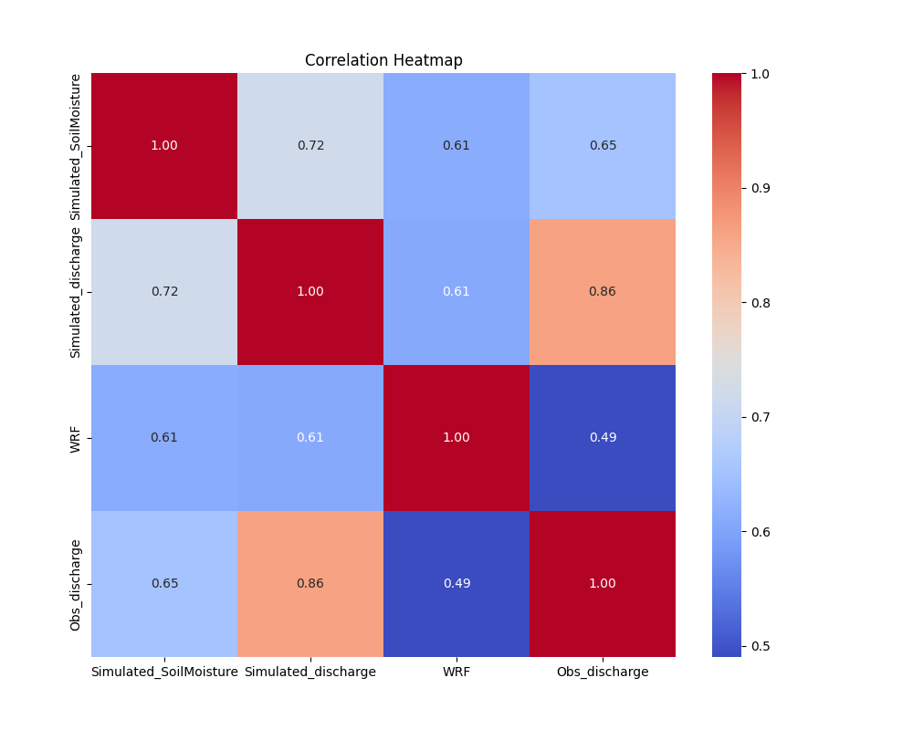

# 📊 CSV Data Profiling Report

**File Analyzed**: `CBC.csv`
**Generated On**: 2025-05-05 15:30:16

## 📌 Basic Info
- Rows: 2089
- Columns: 15

## 🧬 Feature Types
```
age: Numerical
WBC_G_L: Numerical
MCV_fL: Numerical
MCHC_g_L: Numerical
ANC_percent: Numerical
ANC_G_L: Numerical
Lymphocytes_percent: Numerical
Lymphocytes_G_L: Numerical
Monocytes_percent: Numerical
Monocytes_G_L: Numerical
Platelets_G_L: Numerical
PT_percent: Numerical
Fibrinogen_g_L: Numerical
LDH_UI_L: Numerical
Response: Categorical
```

## 📈 Quantile Summary (first 5 columns)
|                     |   count |      mean |        std |   min |      25% |
|:--------------------|--------:|----------:|-----------:|------:|---------:|
| age                 |    2088 |  52.9523  |   22.0362  |  0    |  37      |
| WBC_G_L             |    2085 |  36.4128  |   68.8074  |  0.3  |   2.57   |
| MCV_fL              |    2077 |  92.0025  |    9.38666 | 18.6  |  85.6    |
| MCHC_g_L            |    2075 | 305.718   |   97.9509  | 27.3  | 327      |
| ANC_percent         |    2055 |  21.8113  |   20.675   |  0    |   5      |
| ANC_G_L             |    2055 |   3.61959 |    7.11533 |  0    |   0.41   |
| Lymphocytes_percent |    2051 |  29.2867  |   23.9413  |  0    |   9.0011 |
| Lymphocytes_G_L     |    2051 |   3.24607 |    4.65767 |  0    |   0.97   |
| Monocytes_percent   |    2051 |   6.85598 |   13.522   |  0    |   0      |
| Monocytes_G_L       |    2051 |   2.8037  |   11.9098  |  0    |   0      |
| Platelets_G_L       |    2078 |  83.0611  |   80.0471  |  0    |  29      |
| PT_percent          |    2049 |  77.0065  |   17.0678  |  1.05 |  66      |
| Fibrinogen_g_L      |    2012 |   3.9138  |    2.89891 |  0.39 |   2.7    |
| LDH_UI_L            |    1942 | 822.795   | 1281.81    |  4.6  | 262      |

## 🚫 Missing Data
|                     |   Missing Count |   Missing % |
|:--------------------|----------------:|------------:|
| LDH_UI_L            |             147 |   7.03686   |
| Fibrinogen_g_L      |              77 |   3.68597   |
| PT_percent          |              40 |   1.91479   |
| Lymphocytes_percent |              38 |   1.81905   |
| Lymphocytes_G_L     |              38 |   1.81905   |
| Monocytes_percent   |              38 |   1.81905   |
| Monocytes_G_L       |              38 |   1.81905   |
| ANC_percent         |              34 |   1.62757   |
| ANC_G_L             |              34 |   1.62757   |
| MCHC_g_L            |              14 |   0.670177  |
| MCV_fL              |              12 |   0.574438  |
| Platelets_G_L       |              11 |   0.526568  |
| WBC_G_L             |               4 |   0.191479  |
| age                 |               1 |   0.0478698 |
| Response            |               0 |   0         |

## 🔗 Correlation Matrix (first 5 rows)
|             |        age |    WBC_G_L |     MCV_fL |   MCHC_g_L |   ANC_percent |    ANC_G_L |   Lymphocytes_percent |   Lymphocytes_G_L |   Monocytes_percent |   Monocytes_G_L |   Platelets_G_L |   PT_percent |   Fibrinogen_g_L |    LDH_UI_L |
|:------------|-----------:|-----------:|-----------:|-----------:|--------------:|-----------:|----------------------:|------------------:|--------------------:|----------------:|----------------:|-------------:|-----------------:|------------:|
| age         |  1         | -0.0187533 |  0.325323  | -0.0235968 |     0.104248  |  0.0567903 |            -0.08168   |       -0.0522235  |           0.0977564 |       0.0483489 |      -0.0204369 |   -0.0927528 |        0.0564338 | -0.0312886  |
| WBC_G_L     | -0.0187533 |  1         | -0.0392163 | -0.0117138 |    -0.309676  |  0.433956  |            -0.455415  |        0.542392   |           0.0286993 |       0.306368  |      -0.105243  |   -0.249105  |       -0.0441607 |  0.252869   |
| MCV_fL      |  0.325323  | -0.0392163 |  1         | -0.0720457 |     0.05217   | -0.0422323 |             0.05703   |       -0.0561105  |           0.121611  |       0.0383967 |       0.0430676 |    0.0424164 |        0.0283202 | -0.153017   |
| MCHC_g_L    | -0.0235968 | -0.0117138 | -0.0720457 |  1         |    -0.0731616 | -0.0702147 |             0.047717  |        0.00189763 |          -0.0500098 |       0.013058  |      -0.0673252 |   -0.0239274 |       -0.0498751 | -0.00343472 |
| ANC_percent |  0.104248  | -0.309676  |  0.05217   | -0.0731616 |     1         |  0.186791  |             0.0567465 |       -0.237921   |           0.0166653 |      -0.106767  |       0.232931  |    0.210658  |        0.0657238 | -0.100886   |

## 🧪 Outlier Summary
|                     |   count |   percent |
|:--------------------|--------:|----------:|
| Monocytes_G_L       |     310 | 14.8396   |
| WBC_G_L             |     268 | 12.8291   |
| MCHC_g_L            |     249 | 11.9196   |
| ANC_G_L             |     222 | 10.6271   |
| Monocytes_percent   |     215 | 10.292    |
| Lymphocytes_G_L     |     186 |  8.90378  |
| LDH_UI_L            |     186 |  8.90378  |
| Platelets_G_L       |     127 |  6.07946  |
| Fibrinogen_g_L      |      43 |  2.0584   |
| ANC_percent         |      25 |  1.19674  |
| MCV_fL              |      21 |  1.00527  |
| PT_percent          |      21 |  1.00527  |
| Lymphocytes_percent |       3 |  0.143609 |
| age                 |       0 |  0        |

## 📊 Sample Distributions (Before)


## 📉 Correlation Heatmap


## 🕳️ Missing Data Heatmap


## 🔄 Skewness and Suggested Transformations
No significantly skewed features found.

## 🪄 Normalization Summary
### StandardScaler
|                     |   count |         mean |     std |       min |       25% |        50% |         75% |       max |
|:--------------------|--------:|-------------:|--------:|----------:|----------:|-----------:|------------:|----------:|
| age                 |    2088 |  0           | 1.00024 | -2.40354  | -0.724084 |  0.21314   |  0.773808   |  2.22631  |
| WBC_G_L             |    2085 |  6.38977e-17 | 1.00024 | -0.524964 | -0.491966 | -0.401401  | -0.0102162  |  8.38173  |
| MCV_fL              |    2077 |  5.47361e-17 | 1.00024 | -7.82176  | -0.68225  | -0.0322347 |  0.607124   |  4.32606  |
| MCHC_g_L            |    2075 |  1.36972e-17 | 1.00024 | -2.84311  |  0.217329 |  0.339869  |  0.441986   |  0.952569 |
| ANC_percent         |    2055 |  5.18644e-17 | 1.00024 | -1.05522  | -0.81332  | -0.291333  |  0.580259   | 12.1253   |
| ANC_G_L             |    2055 | -1.72881e-17 | 1.00024 | -0.508827 | -0.451191 | -0.33873   |  0.00778935 | 14.5525   |
| Lymphocytes_percent |    2051 | -1.80147e-16 | 1.00024 | -1.22357  | -0.847509 | -0.26265   |  0.656487   |  5.04328  |
| Lymphocytes_G_L     |    2051 |  5.88943e-17 | 1.00024 | -0.697099 | -0.48879  | -0.291218  |  0.070639   | 12.6905   |
| Monocytes_percent   |    2051 | -5.543e-17   | 1.00024 | -0.507148 | -0.507148 | -0.359205  |  0.0103591  | 13.9509   |
| Monocytes_G_L       |    2051 | -1.38575e-17 | 1.00024 | -0.235469 | -0.235469 | -0.22539   | -0.155683   | 18.5771   |
| Platelets_G_L       |    2078 |  6.83872e-17 | 1.00024 | -1.0379   | -0.675529 | -0.350642  |  0.336619   |  7.08427  |
| PT_percent          |    2049 | -6.43268e-16 | 1.00024 | -4.45136  | -0.645026 |  0.116827  |  0.761471   |  2.51959  |
| Fibrinogen_g_L      |    2012 |  1.05946e-17 | 1.00025 | -1.21586  | -0.418814 | -0.0737709 |  0.34028    | 34.8791   |
| LDH_UI_L            |    1942 | -5.48823e-17 | 1.00026 | -0.638477 | -0.437615 | -0.294031  |  0.0268866  |  9.68193  |
### MinMaxScaler
|                     |   count |      mean |       std |   min |        25% |         50% |        75% |   max |
|:--------------------|--------:|----------:|----------:|------:|-----------:|------------:|-----------:|------:|
| age                 |    2088 | 0.51914   | 0.216042  |     0 | 0.362745   | 0.565176    | 0.686275   |     1 |
| WBC_G_L             |    2085 | 0.0589404 | 0.112302  |     0 | 0.00370491 | 0.013873    | 0.0577934  |     1 |
| MCV_fL              |    2077 | 0.643882  | 0.0823391 |     0 | 0.587719   | 0.641228    | 0.69386    |     1 |
| MCHC_g_L            |    2075 | 0.749038  | 0.263521  |     0 | 0.806295   | 0.838579    | 0.865483   |     1 |
| ANC_percent         |    2055 | 0.0800586 | 0.0758878 |     0 | 0.0183525  | 0.0579554   | 0.124083   |     1 |
| ANC_G_L             |    2055 | 0.0337837 | 0.0664115 |     0 | 0.00382677 | 0.0112936   | 0.0343009  |     1 |
| Lymphocytes_percent |    2051 | 0.195244  | 0.159609  |     0 | 0.0600073  | 0.153333    | 0.3        |     1 |
| Lymphocytes_G_L     |    2051 | 0.0520704 | 0.074714  |     0 | 0.0155598  | 0.0303176   | 0.0573468  |     1 |
| Monocytes_percent   |    2051 | 0.0350771 | 0.0691823 |     0 | 0          | 0.0102326   | 0.0357936  |     1 |
| Monocytes_G_L       |    2051 | 0.0125165 | 0.0531689 |     0 | 0          | 0.000535714 | 0.00424107 |     1 |
| Platelets_G_L       |    2078 | 0.127786  | 0.123149  |     0 | 0.0446154  | 0.0846154   | 0.169231   |     1 |
| PT_percent          |    2049 | 0.638558  | 0.143487  |     0 | 0.546028   | 0.655317    | 0.747793   |     1 |
| Fibrinogen_g_L      |    2012 | 0.0336851 | 0.0277116 |     0 | 0.022082   | 0.0316413   | 0.0431125  |     1 |
| LDH_UI_L            |    1942 | 0.0618655 | 0.0969204 |     0 | 0.0194625  | 0.0333752   | 0.0644706  |     1 |
## 🧠 Advanced Feature Suggestions
| Feature | Description |
|---------|-------------|
| 🔄 Skewness Fix | Identify and suggest log/sqrt transformations for skewed data |
| 🧮 Feature Engineering | Generate interaction terms, polynomial features (optional) |
| 🪄 Auto Normalization | StandardScaler or MinMaxScaler summaries |
| 📊 PCA Visualization | Optional: PCA plot for numeric data |
| 💡 Insights | Flag features with very high correlation or constant values |
| ✅ Data Quality Score | Rate datasets (e.g., based on missing % and outlier % ) |

